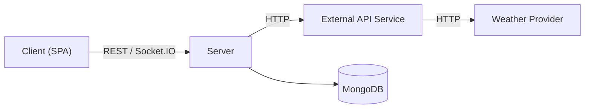
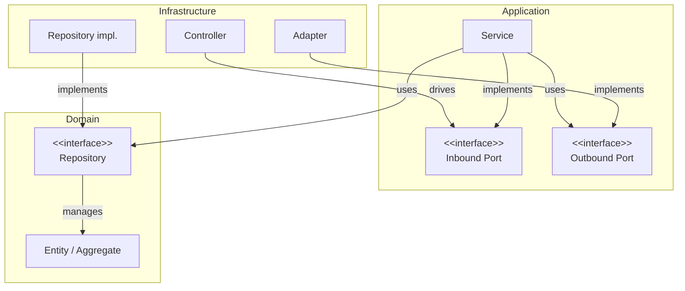

# Architecture

The application is a client-server system composed of four main components that communicate over the network:
- **Client**: a *Single Page Application* that manages the presentational aspects. It retrieves and mutates data through the server's REST APIs, and receives real-time updates (sensor readings, device state changes and the assistant's chat stream) over a WebSocket based channel (Socket.IO).
- **Server**: hosts the core bounded contexts, handles the application logic and serves data to the client.
- **External API Service**: a standalone service that hosts the Environment context. It handles communication with the external weather provider, retrieving and reformatting the data before serving it to the main backend server.
- **Database**: manages data persistence, allowing the server to store and query application data.

The application's domain has been divided into five bounded contexts: four are hosted by the main Node.js server, while the Environment context runs as a standalone Go service. All five follow the *Hexagonal Architecture*, to enforce a clean separation between the domain and technology-specific implementations. Each context's directory tree is structured into three layers:
- **Domain**: the core of the context, it includes entities, value objects, aggregates and domain events. It encapsulates the main business logic and depends on no other layer.
- **Application**: contains the services that implement the use cases acting on the domain entities; it is completely agnostic to technology details.
- **Infrastructure**: provides the technology-specific implementations that drive the services and that the services rely on, such as HTTP and Socket.IO communication, and persistence on a document database (MongoDB).

Following the dependency inversion principle, the domain and application layers define a set of inbound and outbound ports (interfaces), while the infrastructure provides the corresponding adapters. The same mechanism decouples the contexts from one another: a context never depends on another's internals, but only on adapters that translate between their models.

