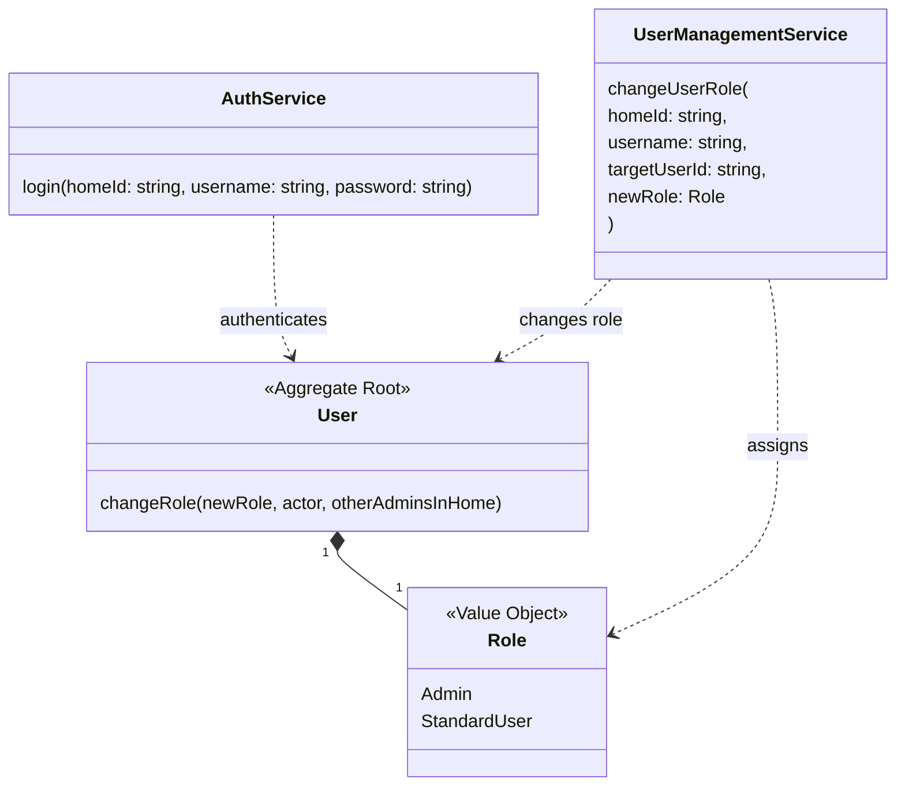
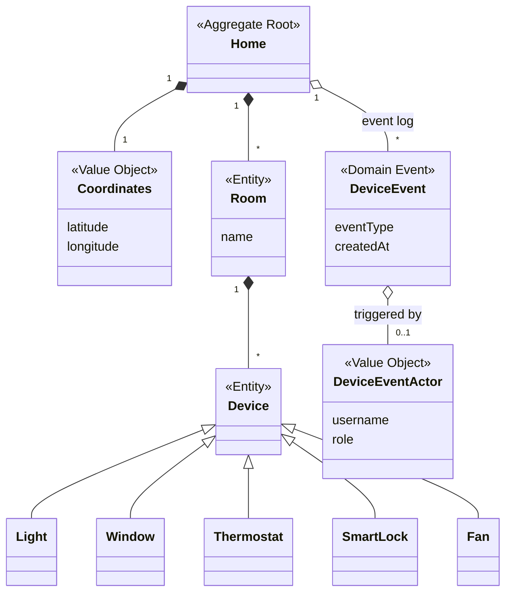
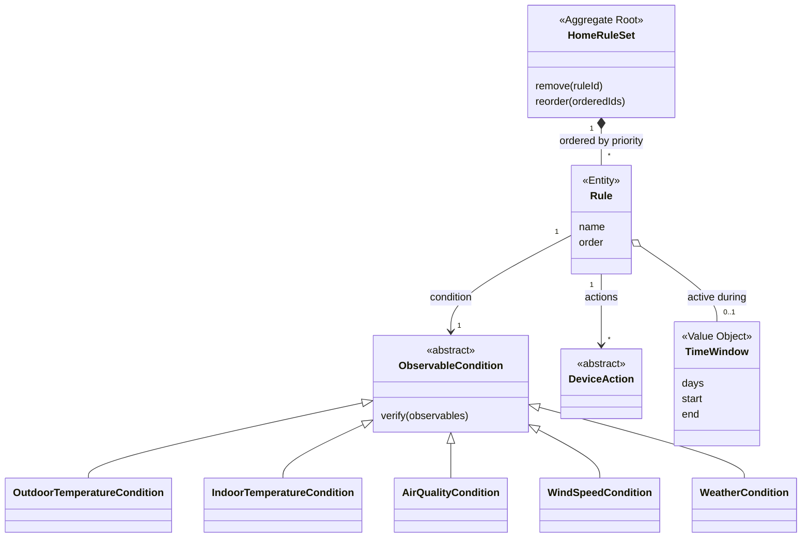
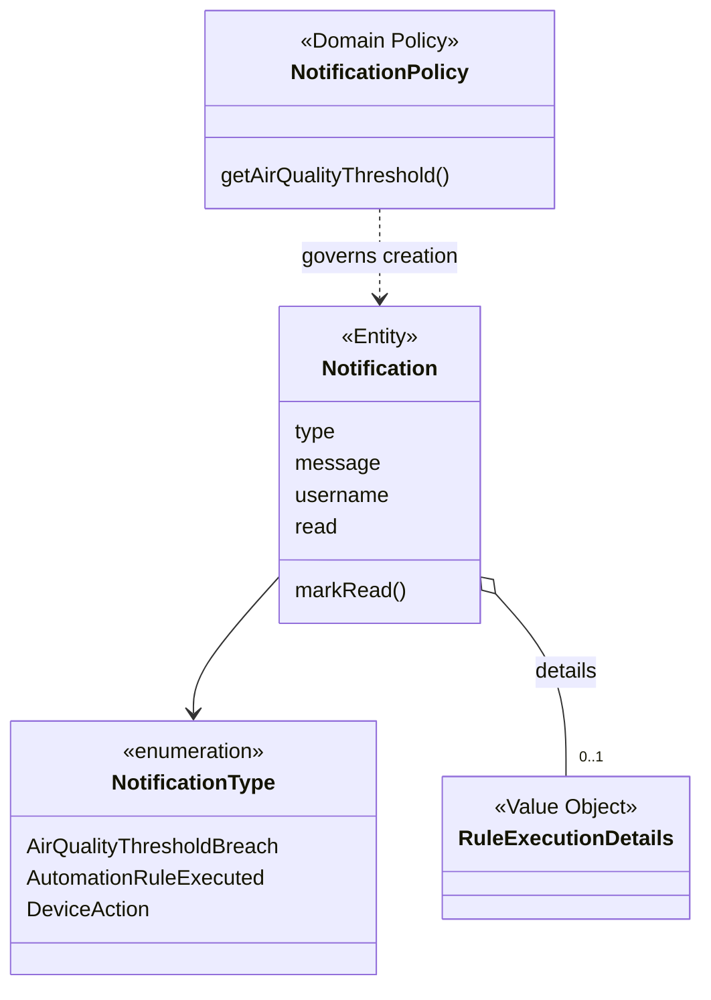
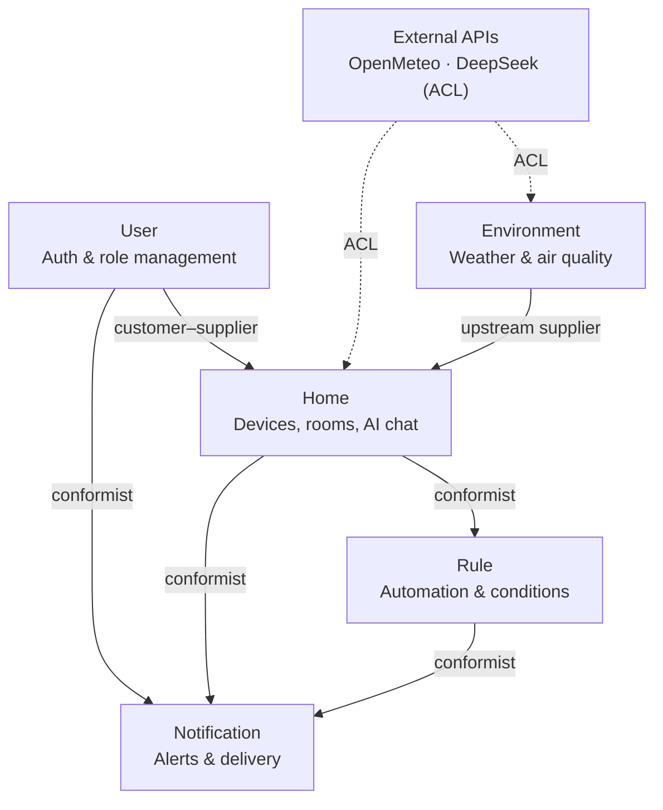

# Design

This chapter outlines the design choices of the HiHome backend.

We structured the backend around **Domain-Driven Design (DDD)** principles, designing five independent **Bounded Contexts** that model separate parts of the problems: User, Home, Rule, Notification and Environment. The following sections detail the client-server interaction model and the design of each specific context.

### Bounded contexts

The application domain is split into five distinct boundaries. Each manages its own data integrity and interacts with the others strictly through well-defined interfaces.

#### User context
This module handles system security, access control, and user profiles. The core of this context is the `User` **aggregate root**, which manages the users, and enforces security aspects in the users role management. User roles (`Admin` or `StandardUser`) are modeled as `Role` **value objects**.

The **`AuthService`** is the component that validates credentials and outputs a stateless token, which will be used by the users to authenticate messages in the session. Role modifications are orchestrated by the **`UserManagementService`**.

The User context acts as a **supplier** of identity and authentication verification. Indirectly, on login, it builds and delivers a JWT that the frontend passes along the requests for authentication purposes. The role information is stored in the JWT and read upon specific requests, for example, when a chat with the AI assistant is started the JWT's role field is used to allow or disallow specific subsets of tools. Directly, the user context is contacted by the home context when an admin user wants to change the privileges of other users of the same home, and by the notification context to retrieve the members of a home and their roles when selecting notification recipients.

#### Home context
This context represents the physical house, and it holds the authoritative state of all rooms and smart devices. Its primary entity is the `Home` **aggregate root**, which contains `Room`s and a variety of `Device`s (lights, windows, thermostats, locks, fans). The system uses the **visitor pattern** to interact with the devices functionalities, keeping the logic separate from the declarations of the devices: in fact, the different types of devices have different operations that can be performed on them, making it difficult to have common methods to perform actions. State changes trigger typed **domain events** that are recorded in an internal event log for auditing.

Two main services drive this context:
* **`HomeService`**: it handles the information regarding the home, handles user actions, sensors readings and devices' state changes.
* **`ChatService`**: it powers the AI assistant. It receives natural language conversations from the frontend, appends the system prompt to the messages and handles the communication with an external Large Language Model through a port.

Additionally, two more services handle the usage metrics and the incoming actions from other contexts (`UsageService` and `ActionService` respectively).

The Home context is in a **conformist** relationship with both the Notification and Rule context, since it pushes to them domain events to evaluate rules and publish notifications, respectively. It is in a **customer-supplier** relationship with the User context, since it collaborates to correctly manage authentication and authorization.

<!-- TODO: con environment è in conformist o customer supplier, dato che environmetn pubblica anche informazioni che home context non usa? -->

#### Rule context
This context handles automation logic. It allows to create, edit and delete automation rules, monitors environmental variables and triggers actions based on user-defined logic. The core model is the **`HomeRuleSet` Aggregate Root**, which maintains a queue of `Rule`s (ordered by priority) to guarantee deterministic execution. A `Rule` links an `ObservableCondition`, that represents a condition that can be evaluated, to specific `DeviceAction`s.

The **`RuleService`** operates primarily as an event listener. Upon catching an `ObservablesUpdatedDomainEvent` from the Home context, it evaluates the rule queue. If conditions are met, it resolves any device conflicts, based on rules priorities, to ensure a single command per device, dispatches execution requests, and forwards an execution summary to the Notification module.

As explained before, it is in a **conformist** relationship with the home context, conforming to the events published by it, and **conformist** relationship with the Notification contexts, since it pushes notification events to the notification context, which adapts to the upstream.

#### Notification context
Designed to handle system-to-user alerts, this context informs users about triggered automations, manual device overrides, or critical environmental shifts. It revolves around the **`Notification` entity**. The context also owns the per-user **notification preferences**: the opt-in selection of notification types each user wants to receive, stored and managed within this context through its own repository.

The **`NotificationService`** listens to domain events generated across the backend. When an event occurs, it evaluates the policy, checks user opt-in preferences through the **`PreferencesService`**, and dispatches the alert. The `PreferencesService` manages the stored preferences and selects the recipients of a notification: it retrieves the members of a home and their roles from the User context, then filters them against their stored preferences.

This context adopts a **Conformist** pattern towards the other contexts it receives data from. It blindly consumes events produced by the Home and Rule contexts without demanding any structural or data format changes from them, and it queries the User context for home membership information through an adapter that translates the User context's model into its own.

#### Environment Context
This context is responsible for retrieving data about external weather and air quality conditions. It communicates with third-party meteorological APIs to retrieve raw data, and translates it into the system's internal domain models.

The service exposes REST endpoints that serve real-time environmental data, historical records, and weather forecasts.

It acts as an **upstream supplier** to the Home context. It abstracts the core backend from external weather providers, ensuring the Home context only interacts with interfaces independent of the specific weather providers used.

### External integration

To protect the pure domain logic from third-party API changes, all external communications are shielded by an **Anti-Corruption Layer (ACL)**. Adapters for the `ForecastPort`, and `ChatCompletionPort` (in Environment and Home contexts, respectively) translate raw data from weather and air-quality APIs (from Open Meteo) and Large Language Models (from DeepSeek) into the system's ubiquitous language. This ensures that the core domain remains completely agnostic to the specific external vendors being used, making external dependencies easily swappable.

### Context map

The diagram below summarises the strategic relationships between the five bounded contexts:

